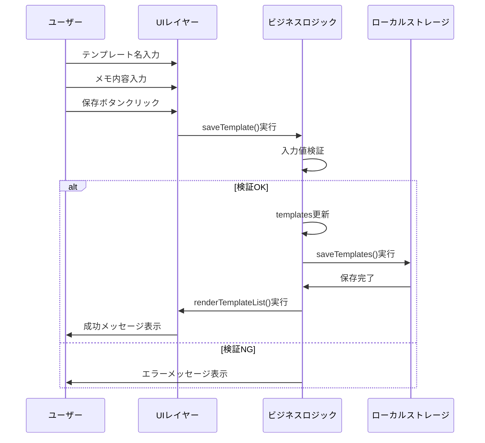
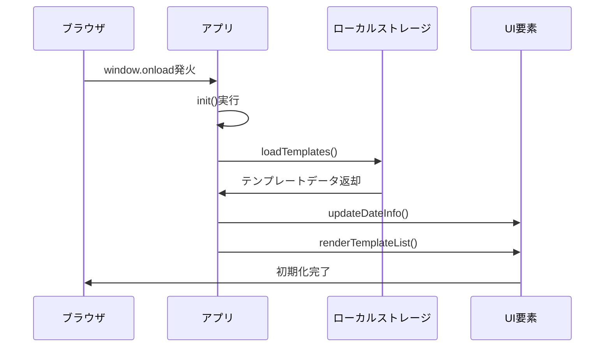

# 詳細設計書 - メモ帳アプリ

## クラス・モジュール単位の責務

### JavaScript関数設計

#### 初期化系

**init()**
- **責務**: アプリケーション初期化処理
- **入力**: なし
- **出力**: なし
- **例外**: なし
- **前提条件**: DOM構築完了
- **事後条件**: アプリ使用可能状態

**loadTemplates()**
- **責務**: ローカルストレージからテンプレート読み込み
- **入力**: なし
- **出力**: なし（グローバル変数templatesに設定）
- **例外**: JSON.parse() エラー時は空オブジェクト設定
- **前提条件**: ローカルストレージアクセス可能
- **事後条件**: templatesに有効なオブジェクトが設定される

#### UI更新系

**updateDateInfo()**
- **責務**: 現在日付の表示更新
- **入力**: なし
- **出力**: なし
- **例外**: なし
- **前提条件**: dateInfo要素が存在
- **事後条件**: 日付表示が現在日時に更新

**renderTemplateList()**
- **責務**: テンプレート一覧のDOM構築
- **入力**: なし（グローバル変数templatesを参照）
- **出力**: なし
- **例外**: なし
- **前提条件**: templateList要素が存在
- **事後条件**: テンプレート一覧が最新状態で表示

#### データ操作系

**saveTemplates()**
- **責務**: テンプレートデータのローカルストレージ保存
- **入力**: なし（グローバル変数templatesを参照）
- **出力**: なし
- **例外**: localStorage例外時はconsole.error
- **前提条件**: templatesオブジェクトが有効
- **事後条件**: ローカルストレージにデータ保存完了

**selectTemplate(name)**
- **責務**: テンプレート選択とUI反映
- **入力**: name (string) - テンプレート名
- **出力**: なし
- **例外**: なし
- **前提条件**: nameが存在するテンプレート名
- **事後条件**: 選択状態の視覚的変更とメモエリア更新

#### ユーザーアクション系

**saveTemplate()**
- **責務**: 新規テンプレート保存
- **入力**: なし（UIからの値取得）
- **出力**: なし
- **例外**: なし（入力チェックでリターン）
- **前提条件**: テンプレート名が入力済み
- **事後条件**: テンプレート保存と一覧更新

**deleteTemplate()**
- **責務**: 選択中テンプレートの削除
- **入力**: なし（selectedTemplateを参照）
- **出力**: なし
- **例外**: なし（選択状態チェックでリターン）
- **前提条件**: テンプレートが選択済み
- **事後条件**: テンプレート削除と一覧更新

## 入出力・例外・前後条件

### データフロー図

```
ユーザー操作
    ↓
イベントハンドラ
    ↓
ビジネスロジック
    ↓
データ操作（templates）
    ↓
ローカルストレージ
    ↓
UI更新
```

### 例外処理詳細

```javascript
// パターン1: 入力値検証
function saveTemplate() {
    const name = document.getElementById('templateName').value.trim();
    if (!name) {
        alert('テンプレート名を入力してください');
        return; // 早期リターン
    }
    // 正常処理継続
}

// パターン2: ローカルストレージ例外
function saveTemplates() {
    try {
        localStorage.setItem('memoAppTemplates', JSON.stringify(templates));
    } catch (error) {
        console.error('テンプレート保存エラー:', error);
        alert('データの保存に失敗しました');
    }
}

// パターン3: データ読み込み例外
function loadTemplates() {
    const saved = localStorage.getItem('memoAppTemplates');
    if (saved) {
        try {
            templates = JSON.parse(saved);
        } catch (error) {
            console.error('データ読み込みエラー:', error);
            templates = {}; // デフォルト値設定
        }
    }
}
```

## データ構造とアルゴリズム

### データ構造

```javascript
// メインデータ構造
const templates = {
    "テンプレート名": "テンプレート内容（改行含む文字列）"
};

// 状態管理
let selectedTemplate = null; // string | null

// DOM要素参照
const elements = {
    templateName: document.getElementById('templateName'),
    memoText: document.getElementById('memoText'),
    templateList: document.getElementById('templateList'),
    dateInfo: document.getElementById('dateInfo')
};
```

### アルゴリズム

#### テンプレート一覧描画
```
function renderTemplateList():
    1. templateList要素をクリア
    2. templates の各キーに対してループ:
        a. div要素作成（template-item）
        b. テンプレート名とプレビューを設定
        c. クリックイベントリスナー追加
        d. 選択状態の場合は背景色変更
        e. templateListに追加
    3. 描画完了
```

#### 日付フォーマット
```
function formatDate(date):
    1. date.getFullYear() で年取得
    2. date.getMonth() + 1 で月取得（0ベース調整）
    3. date.getDate() で日取得
    4. String.padStart(2, '0') でゼロパディング
    5. "YYYY/MM/DD" 形式で文字列結合
    6. 結果を返却
```

#### テンプレートからコピー
```
function copyFromTemplate():
    1. selectedTemplate 存在チェック
    2. 現在日付をフォーマット（YYYY/MM/DD）
    3. テンプレート内容取得
    4. 日付 + 改行2つ + テンプレート内容 で結合
    5. memoText に設定
    6. 選択状態をリセット
```

## 擬似コードまたはシーケンス図

### テンプレート保存シーケンス



### アプリ初期化シーケンス



## SQLスキーマ・DDL・差分

本アプリケーションはローカルストレージを使用するため、SQLデータベースは使用しない。

### ローカルストレージスキーマ

```javascript
// キー: "memoAppTemplates"
// 値: JSON文字列
{
    "テンプレート名1": "テンプレート内容1",
    "テンプレート名2": "テンプレート内容2"
}

// 制約事項
// - キー名: 空文字列不可、文字列のみ
// - 値: 文字列のみ（改行コード含む）
// - 総容量: ブラウザ制限内（通常5-10MB）
```

## 設定値・環境依存の扱い

### 設定値

```javascript
// アプリケーション定数
const CONFIG = {
    STORAGE_KEY: 'memoAppTemplates',
    DATE_FORMAT: 'YYYY/MM/DD',
    MAX_PREVIEW_LENGTH: 50,
    WEEKDAYS: ['日', '月', '火', '水', '木', '金', '土']
};

// CSS設定値
:root {
    --primary-color: #667eea;
    --secondary-color: #764ba2;
    --text-color: #333;
    --background-color: #f5f5f5;
    --border-color: #dee2e6;
}
```

### 環境依存要素

**ブラウザ互換性**
- LocalStorage API: IE8以降
- ES6記法: Chrome 49+, Firefox 45+, Safari 10+
- Flexbox: IE11以降

**画面サイズ対応**
```css
/* デスクトップ */
@media (min-width: 769px) {
    .main-content { flex-direction: row; }
    .sidebar { width: 300px; }
}

/* モバイル */
@media (max-width: 768px) {
    .main-content { flex-direction: column; }
    .sidebar { width: 100%; }
}
```

## テスト観点

### ユニットテスト観点

**初期化処理**
- [ ] `init()` 実行でテンプレート読み込み完了
- [ ] `updateDateInfo()` で正しい日付表示
- [ ] `loadTemplates()` でJSONパースエラー時のフォールバック

**テンプレート操作**
- [ ] `saveTemplate()` で空名前時のエラーハンドリング
- [ ] `deleteTemplate()` で未選択時のエラーハンドリング
- [ ] `selectTemplate()` で正しい選択状態更新

**日付処理**
- [ ] `copyFromTemplate()` で正しい日付フォーマット
- [ ] `newMemo()` で日付のみメモ作成
- [ ] 月日の0パディング正常性

### 結合テスト観点

**データ永続化**
- [ ] テンプレート保存後のブラウザ再起動での復元
- [ ] 複数テンプレート保存・読み込み
- [ ] ローカルストレージ制限時のエラーハンドリング

**UI統合**
- [ ] テンプレート選択→コピーの一連操作
- [ ] テンプレート保存→一覧表示更新
- [ ] レスポンシブデザインでの操作性

### E2Eテスト観点

**ユーザーシナリオ**
1. **初回利用**: アプリ起動→テンプレート作成→保存→コピーでメモ作成
2. **継続利用**: アプリ再起動→既存テンプレート選択→編集→新規保存
3. **管理操作**: テンプレート複数作成→選択削除→確認

**エラーシナリオ**
1. **入力エラー**: 空名前での保存試行→エラーメッセージ確認
2. **操作エラー**: 未選択状態での削除試行→エラーメッセージ確認
3. **環境エラー**: ローカルストレージ無効環境での動作確認

### 性能テスト観点

- [ ] 100個テンプレート保存時の応答性
- [ ] 大容量テンプレート（10KB）の保存・読み込み時間
- [ ] モバイルデバイスでの操作レスポンス