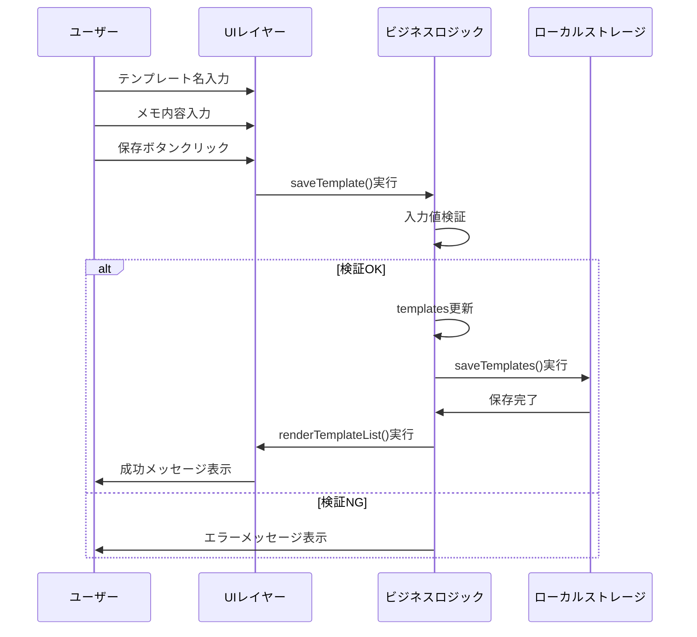
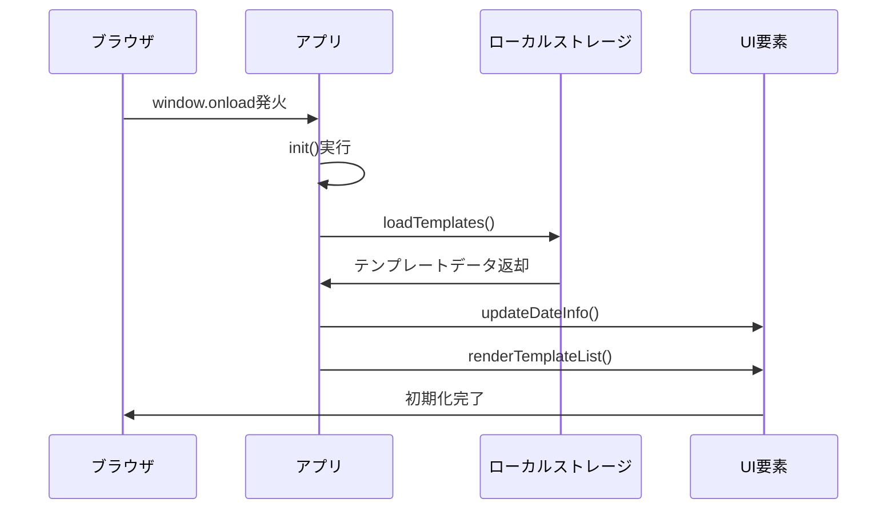

# 詳細設計書 - メモ帳アプリ

## クラス・モジュール単位の責務

### JavaScript関数設計

#### 初期化系

**init()**
- **責務**: アプリケーション初期化処理
- **入力**: なし
- **出力**: なし
- **例外**: なし
- **前提条件**: DOM構築完了
- **事後条件**: アプリ使用可能状態

**loadTemplates()**
- **責務**: ローカルストレージからテンプレート読み込み
- **入力**: なし
- **出力**: なし（グローバル変数templatesに設定）
- **例外**: JSON.parse() エラー時は空オブジェクト設定
- **前提条件**: ローカルストレージアクセス可能
- **事後条件**: templatesに有効なオブジェクトが設定される

#### UI更新系

**updateDateInfo()**
- **責務**: 現在日付の表示更新
- **入力**: なし
- **出力**: なし
- **例外**: なし
- **前提条件**: dateInfo要素が存在
- **事後条件**: 日付表示が現在日時に更新

**renderTemplateList()**
- **責務**: テンプレート一覧のDOM構築
- **入力**: なし（グローバル変数templatesを参照）
- **出力**: なし
- **例外**: なし
- **前提条件**: templateList要素が存在
- **事後条件**: テンプレート一覧が最新状態で表示

#### データ操作系

**saveTemplates()**
- **責務**: テンプレートデータのローカルストレージ保存
- **入力**: なし（グローバル変数templatesを参照）
- **出力**: なし
- **例外**: localStorage例外時はconsole.error
- **前提条件**: templatesオブジェクトが有効
- **事後条件**: ローカルストレージにデータ保存完了

**selectTemplate(name)**
- **責務**: テンプレート選択とUI反映
- **入力**: name (string) - テンプレート名
- **出力**: なし
- **例外**: なし
- **前提条件**: nameが存在するテンプレート名
- **事後条件**: 選択状態の視覚的変更とメモエリア更新

#### ユーザーアクション系

**saveTemplate()**
- **責務**: 新規テンプレート保存
- **入力**: なし（UIからの値取得）
- **出力**: なし
- **例外**: なし（入力チェックでリターン）
- **前提条件**: テンプレート名が入力済み
- **事後条件**: テンプレート保存と一覧更新

**deleteTemplate()**
- **責務**: 選択中テンプレートの削除
- **入力**: なし（selectedTemplateを参照）
- **出力**: なし
- **例外**: なし（選択状態チェックでリターン）
- **前提条件**: テンプレートが選択済み
- **事後条件**: テンプレート削除と一覧更新

## 入出力・例外・前後条件

### データフロー図

```
ユーザー操作
    ↓
イベントハンドラ
    ↓
ビジネスロジック
    ↓
データ操作（templates）
    ↓
ローカルストレージ
    ↓
UI更新
```

### 例外処理詳細

```javascript
// パターン1: 入力値検証
function saveTemplate() {
    const name = document.getElementById('templateName').value.trim();
    if (!name) {
        alert('テンプレート名を入力してください');
        return; // 早期リターン
    }
    // 正常処理継続
}

// パターン2: ローカルストレージ例外
function saveTemplates() {
    try {
        localStorage.setItem('memoAppTemplates', JSON.stringify(templates));
    } catch (error) {
        console.error('テンプレート保存エラー:', error);
        alert('データの保存に失敗しました');
    }
}

// パターン3: データ読み込み例外
function loadTemplates() {
    const saved = localStorage.getItem('memoAppTemplates');
    if (saved) {
        try {
            templates = JSON.parse(saved);
        } catch (error) {
            console.error('データ読み込みエラー:', error);
            templates = {}; // デフォルト値設定
        }
    }
}
```

## データ構造とアルゴリズム

### データ構造

```javascript
// メインデータ構造
const templates = {
    "テンプレート名": "テンプレート内容（改行含む文字列）"
};

// 状態管理
let selectedTemplate = null; // string | null

// DOM要素参照
const elements = {
    templateName: document.getElementById('templateName'),
    memoText: document.getElementById('memoText'),
    templateList: document.getElementById('templateList'),
    dateInfo: document.getElementById('dateInfo')
};
```

### アルゴリズム

#### テンプレート一覧描画
```
function renderTemplateList():
    1. templateList要素をクリア
    2. templates の各キーに対してループ:
        a. div要素作成（template-item）
        b. テンプレート名とプレビューを設定
        c. クリックイベントリスナー追加
        d. 選択状態の場合は背景色変更
        e. templateListに追加
    3. 描画完了
```

#### 日付フォーマット
```
function formatDate(date):
    1. date.getFullYear() で年取得
    2. date.getMonth() + 1 で月取得（0ベース調整）
    3. date.getDate() で日取得
    4. String.padStart(2, '0') でゼロパディング
    5. "YYYY/MM/DD" 形式で文字列結合
    6. 結果を返却
```

#### 日付プレースホルダ置換機能
```
function addDateToMemo():
    1. メモ内容の存在チェック
    2. 現在日付をフォーマット（YYYY/MM/DD, MM/DD）
    3. プレースホルダ置換処理:
        a. mm/dd パターンを MM/DD に置換（完全一致のみ）
        b. yyyy, mm, dd の個別置換
    4. 置換結果に応じた処理:
        - mm/dd が置換された場合: 置換メッセージ表示
        - yyyy/mm/dd のみ置換された場合: 置換メッセージ表示
        - 置換なしの場合: 先頭に日付・時刻を追加
    5. 結果をmemoTextに設定
```

**重要な修正点:**
- mm/dd の正規表現を `/\bmm\/dd\b/g` から `/^mm\/dd$|(?<=\s)mm\/dd(?=\s)|(?<=^)mm\/dd(?=$)/gm` に変更
- 行頭、行末、スペース区切りの mm/dd のみを対象とする
- 数字の日付（例: 09/27）は置換対象外とする

## 擬似コードまたはシーケンス図

### テンプレート保存シーケンス



### アプリ初期化シーケンス



## SQLスキーマ・DDL・差分

本アプリケーションはローカルストレージを使用するため、SQLデータベースは使用しない。

### ローカルストレージスキーマ

```javascript
// キー: "memoAppTemplates"
// 値: JSON文字列
{
    "テンプレート名1": "テンプレート内容1",
    "テンプレート名2": "テンプレート内容2"
}

// 制約事項
// - キー名: 空文字列不可、文字列のみ
// - 値: 文字列のみ（改行コード含む）
// - 総容量: ブラウザ制限内（通常5-10MB）
```

## 設定値・環境依存の扱い

### 設定値

```javascript
// アプリケーション定数
const CONFIG = {
    STORAGE_KEY: 'memoAppTemplates',
    DATE_FORMAT: 'YYYY/MM/DD',
    MAX_PREVIEW_LENGTH: 50,
    WEEKDAYS: ['日', '月', '火', '水', '木', '金', '土']
};

// CSS設定値
:root {
    --primary-color: #667eea;
    --secondary-color: #764ba2;
    --text-color: #333;
    --background-color: #f5f5f5;
    --border-color: #dee2e6;
    
    /* シニア世代対応設定 */
    --base-font-size: 16px;
    --large-font-size: 18px;
    --button-font-size: 18px;
    --min-touch-target: 48px;
    --high-contrast-ratio: 4.5; /* WCAG AA準拠 */
    --hover-transition: 0.2s ease;
    
    /* スマートフォン対応 */
    --mobile-padding: 16px;
    --mobile-button-height: 56px;
    --mobile-input-height: 48px;
}
```

### 環境依存要素

**ブラウザ互換性**
- LocalStorage API: IE8以降
- ES6記法: Chrome 49+, Firefox 45+, Safari 10+
- Flexbox: IE11以降

**画面サイズ対応**
```css
/* スマートフォン（シニア対応強化） */
@media (max-width: 768px) {
    .main-content { 
        flex-direction: column; 
        padding: var(--mobile-padding);
    }
    .sidebar { 
        width: 100%; 
        order: 1; /* テンプレート選択を上部に */
    }
    .memo-area { order: 2; }
    
    /* シニア向け大きなタッチターゲット */
    button {
        min-height: var(--mobile-button-height);
        font-size: var(--button-font-size);
        padding: 12px 24px;
    }
    
    input, textarea {
        min-height: var(--mobile-input-height);
        font-size: var(--base-font-size);
    }
}

/* タブレット */
@media (min-width: 769px) and (max-width: 1024px) {
    .main-content { 
        flex-direction: row; 
        gap: 20px;
    }
    .sidebar { width: 300px; }
    
    /* タッチターゲットサイズ維持 */
    button {
        min-height: var(--min-touch-target);
    }
}

/* デスクトップ */
@media (min-width: 1025px) {
    .main-content { 
        flex-direction: row; 
        max-width: 1200px;
        margin: 0 auto;
    }
    .sidebar { width: 350px; }
}
```

## シニア世代向けUI実装詳細

### アクセシビリティ実装方針

**フォントサイズとタイポグラフィ**
```css
/* 基本テキスト */
body {
    font-size: var(--base-font-size);
    line-height: 1.6; /* 読みやすさ向上 */
    font-family: 'Hiragino Kaku Gothic ProN', 'Yu Gothic', 'Meiryo', sans-serif;
}

/* ボタンテキスト */
button {
    font-size: var(--button-font-size);
    font-weight: 600; /* 視認性向上 */
    letter-spacing: 0.02em; /* 文字間隔調整 */
}

/* ラベルテキスト */
label {
    font-size: var(--large-font-size);
    font-weight: 500;
    color: var(--text-color);
}
```

**高コントラスト設計**
```css
/* WCAG AA準拠のカラーパレット */
:root {
    /* メインテキスト: コントラスト比 7:1 */
    --text-primary: #1a1a1a;
    --background-primary: #ffffff;
    
    /* ボタン: コントラスト比 4.5:1以上 */
    --button-bg: #2563eb;
    --button-text: #ffffff;
    --button-hover-bg: #1d4ed8;
    
    /* フォーカス表示 */
    --focus-outline: #f59e0b;
    --focus-outline-width: 3px;
}

button:focus {
    outline: var(--focus-outline-width) solid var(--focus-outline);
    outline-offset: 2px;
}
```

**タッチターゲット最適化**
```css
/* 最小48px四方のタッチエリア確保 */
.touch-target {
    min-width: var(--min-touch-target);
    min-height: var(--min-touch-target);
    position: relative;
}

/* タッチ領域の視覚的フィードバック */
button:hover {
    transform: translateY(-1px);
    box-shadow: 0 4px 8px rgba(0, 0, 0, 0.1);
    transition: var(--hover-transition);
}

button:active {
    transform: translateY(0);
    box-shadow: 0 2px 4px rgba(0, 0, 0, 0.1);
}
```

### スマートフォン対応実装

**レイアウト優先順位**
```css
/* モバイル優先のレイアウト順序 */
.mobile-layout {
    display: flex;
    flex-direction: column;
}

.mobile-layout .template-section {
    order: 1; /* 最重要: テンプレート選択 */
    margin-bottom: 20px;
}

.mobile-layout .memo-section {
    order: 2; /* メモ入力エリア */
    flex: 1;
}

.mobile-layout .action-buttons {
    order: 3; /* アクションボタン群 */
    position: sticky;
    bottom: 0;
    background: var(--background-primary);
    padding: 16px;
    box-shadow: 0 -2px 8px rgba(0, 0, 0, 0.1);
}
```

**タッチ操作最適化**
```javascript
// タッチイベント最適化
function optimizeTouchEvents() {
    // ダブルタップズーム無効化（ボタン領域）
    document.querySelectorAll('button').forEach(button => {
        button.addEventListener('touchstart', function(e) {
            e.preventDefault();
        }, { passive: false });
    });
    
    // スクロール領域の慣性スクロール有効化
    const scrollableElements = document.querySelectorAll('.scrollable');
    scrollableElements.forEach(element => {
        element.style.webkitOverflowScrolling = 'touch';
    });
}
```

### 誤操作防止実装

**確認ダイアログ強化**
```javascript
// シニア向け確認ダイアログ
function showConfirmDialog(message, onConfirm, onCancel) {
    const dialog = document.createElement('div');
    dialog.className = 'senior-confirm-dialog';
    dialog.innerHTML = `
        <div class="dialog-content">
            <h3 class="dialog-title">確認</h3>
            <p class="dialog-message">${message}</p>
            <div class="dialog-buttons">
                <button class="confirm-button" onclick="handleConfirm()">はい</button>
                <button class="cancel-button" onclick="handleCancel()">いいえ</button>
            </div>
        </div>
    `;
    
    // 大きなボタンとクリアなラベル
    const buttons = dialog.querySelectorAll('button');
    buttons.forEach(button => {
        button.style.minHeight = '56px';
        button.style.fontSize = '18px';
        button.style.padding = '16px 32px';
        button.style.margin = '8px';
    });
    
    document.body.appendChild(dialog);
}

// 危険操作の二重確認
function deleteTemplateWithConfirmation() {
    if (!selectedTemplate) {
        showAlert('削除するテンプレートを選択してください');
        return;
    }
    
    const templateName = selectedTemplate;
    showConfirmDialog(
        `「${templateName}」を削除しますか？\nこの操作は取り消せません。`,
        () => {
            // 実際の削除処理
            delete templates[templateName];
            saveTemplates();
            renderTemplateList();
            showAlert('テンプレートを削除しました');
        },
        () => {
            // キャンセル時の処理
            showAlert('削除をキャンセルしました');
        }
    );
}
```

### キーボードアクセシビリティ

**Tab順序制御**
```javascript
// キーボードナビゲーション最適化
function setupKeyboardNavigation() {
    const focusableElements = [
        'button',
        'input',
        'textarea',
        '[tabindex]:not([tabindex="-1"])'
    ];
    
    const elements = document.querySelectorAll(focusableElements.join(','));
    elements.forEach((element, index) => {
        element.setAttribute('tabindex', index + 1);
        
        // Enterキーでボタン操作
        element.addEventListener('keydown', function(e) {
            if (e.key === 'Enter' && element.tagName === 'BUTTON') {
                element.click();
            }
        });
    });
}

// ショートカットキー実装
document.addEventListener('keydown', function(e) {
    // Ctrl+S: テンプレート保存
    if (e.ctrlKey && e.key === 's') {
        e.preventDefault();
        saveTemplate();
    }
    
    // Ctrl+N: 新規メモ
    if (e.ctrlKey && e.key === 'n') {
        e.preventDefault();
        newMemo();
    }
});
```

## テスト観点

### ユニットテスト観点

**初期化処理**
- [ ] `init()` 実行でテンプレート読み込み完了
- [ ] `updateDateInfo()` で正しい日付表示
- [ ] `loadTemplates()` でJSONパースエラー時のフォールバック

**テンプレート操作**
- [ ] `saveTemplate()` で空名前時のエラーハンドリング
- [ ] `deleteTemplate()` で未選択時のエラーハンドリング
- [ ] `selectTemplate()` で正しい選択状態更新

**日付処理**
- [ ] `copyFromTemplate()` で正しい日付フォーマット
- [ ] `newMemo()` で日付のみメモ作成
- [ ] 月日の0パディング正常性

### 結合テスト観点

**データ永続化**
- [ ] テンプレート保存後のブラウザ再起動での復元
- [ ] 複数テンプレート保存・読み込み
- [ ] ローカルストレージ制限時のエラーハンドリング

**UI統合**
- [ ] テンプレート選択→コピーの一連操作
- [ ] テンプレート保存→一覧表示更新
- [ ] レスポンシブデザインでの操作性

### E2Eテスト観点

**ユーザーシナリオ**
1. **初回利用**: アプリ起動→テンプレート作成→保存→コピーでメモ作成
2. **継続利用**: アプリ再起動→既存テンプレート選択→編集→新規保存
3. **管理操作**: テンプレート複数作成→選択削除→確認

**エラーシナリオ**
1. **入力エラー**: 空名前での保存試行→エラーメッセージ確認
2. **操作エラー**: 未選択状態での削除試行→エラーメッセージ確認
3. **環境エラー**: ローカルストレージ無効環境での動作確認

### 性能テスト観点

- [ ] 100個テンプレート保存時の応答性
- [ ] 大容量テンプレート（10KB）の保存・読み込み時間
- [ ] モバイルデバイスでの操作レスポンス

### アクセシビリティテスト観点

**シニア世代対応テスト**
- [ ] フォントサイズが16px以上で表示される
- [ ] ボタンのタップターゲットが48px四方以上
- [ ] コントラスト比がWCAG AA準拠（4.5:1以上）
- [ ] 高齢者モニターによる実操作テスト
- [ ] 老眼鏡使用時の視認性確認

**スマートフォンUIテスト**
- [ ] 縦持ち・横持ち両方でのレイアウト確認
- [ ] タッチ操作の応答性と精度
- [ ] スクロール操作のスムーズさ
- [ ] 画面キーボード表示時のレイアウト崩れ確認
- [ ] iOS Safari/Android Chrome での動作確認

**キーボードアクセシビリティテスト**
- [ ] Tab キーでの順序正しいフォーカス移動
- [ ] Enter/Space キーでのボタン操作
- [ ] ショートカットキー（Ctrl+S, Ctrl+N）の動作
- [ ] フォーカス表示の視認性確認
- [ ] キーボードのみでの全機能操作可能性

**誤操作防止テスト**
- [ ] 削除操作時の確認ダイアログ表示
- [ ] 重要操作の取り消し可能性
- [ ] 明確な操作フィードバック
- [ ] エラーメッセージの分かりやすさ
- [ ] 操作完了通知の適切性

**多様なユーザー環境テスト**
- [ ] 視力の弱い方での操作性
- [ ] 手の震えがある方でのタッチ操作
- [ ] 認知負荷軽減の効果確認
- [ ] 長時間使用時の疲労度評価